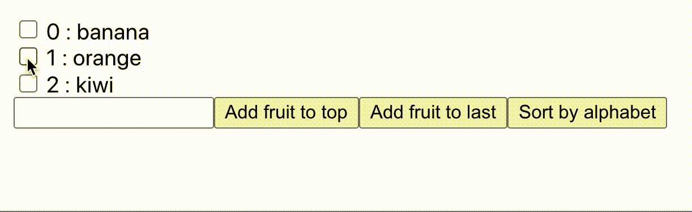
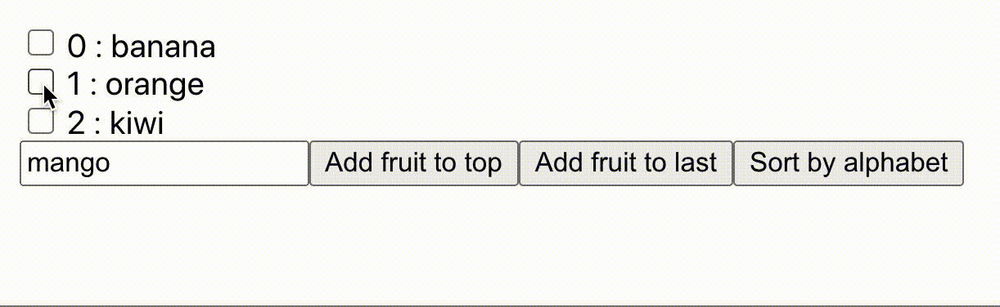

# What is this?

Everyone try to say what would happen if you use indexes as a key. But no one explain why.

# Array performance fundamental

When you add data to an array. If you push some data into the last of the array, only thing that it do is add more id.

```js
[0, 1, 2][
  // item : [0, 1, 2]
  // id   : [0, 1, 2]

  // push something at the last
  (0, 1, 2, 3)
];
// item : [0, 1, 2, 3] <-- great! only add 3 to the end
// id   : [0, 1, 2, 3]
```

But when you add something at the start of the array, the id is break. The array would relocate the ids. And, you know, you lost the performance for relocate the ids.

```js
[0, 1, 2][
  // item : [0, 1, 2]
  // id   : [0, 1, 2]

  (3, 0, 1, 2)
];
// item : [3, 0, 1, 2]
// id   : [0, 1, 2, 3] <-- BOOM! `every` item must relocate its id
```

This happen with insert too!

```js
[0, 1, 2][
  // item : [0, 1, 2]
  // id   : [0, 1, 2]

  (0, 1, 3, 2)
];
// item : [0, 1, 3, 2]
// id   : [0, 1, 2, 3] <-- Now 3 and 2 have to relocate its id.

// Imagine when you insert the data in the middle of an array which contains at least 100, 1k, or even 10k items... Your app would scream so loud. Poor app :(
```

# Updating the app

When React rerender the app. It use a diff algolithm to decide what should it update.

But on the list of data. React iterated the value.

```jsx
// Before

<ul>
  <li>Orange</li>
  <li>Kiwi</li>
</ul>

// after
<ul>
  <li>Orange</li>
  <li>Kiwi</li>
  <li>Banana</li>
</ul>
```

As I mention in the last chapter, insert into the end does nothing with the app. React will iterate over the list and diff them. It will match the `<li>Orange</li>` and `<li>Kiwi</li>` and insert only `<li>Banana</li>`.

Worst thing happened when you insert the `<li>Banana</li>` at the top of `<ul>`. React will rerender the whole list instead of knowing that `<li>Orange</li>` and `<li>Kiwi</li>` haven't been changed.

# Key save the day!

React provide `key` for easily access the data. Just like the object.

```jsx
// Before

<ul>
  <li key="orange">Orange</li>
  <li key="kiwi">Kiwi</li>
</ul>

// after
<ul>
  <li key="banana">Banana</li>
  <li key="orange">Orange</li>
  <li key="kiwi">Kiwi</li>
</ul>
```

You can imagine situation as follow

```js
const before = {
  orange: "Orange",
  kiwi: "Kiwi",
};

const after = {
  banana: "Banana",
  orange: "Orange",
  kiwi: "Kiwi",
};
```

You look at the object and already know that before.orange and after.orange is the same.
This kinda like React `key`. The app using the `key` to diff the data. If element's value at the key is changed, then the app will update the list.

# Using index as the key

Here comes the fun part. Why using index as the key should be avoid?
Everyone tell us that using index as the key would break the app, and show their app example. But how?

Suppose that you implement the checkbox, for let user select what they want.

```jsx
<ul>
  <li key={0}>
    <input type="checkbox" />
    Banana
  </li>

  <li key={1}>
    <input type="checkbox" />
    Orange
  </li>

  <li key={2}>
    <input type="checkbox" />
    Kiwi
  </li>
</ul>
```

And then user check the `Orange` and the `Kiwi`. After that, user then added more item at the start of the array.

```jsx
<ul>
  <li key={0}>
    <input type="checkbox" />
    Watermelon
  </li>

  <li key={1}>
    <input type="checkbox" />
    Banana
  </li>

  <li key={2}>
    <input type="checkbox" />
    Orange
  </li>

  <li key={3}>
    <input type="checkbox" />
    Kiwi
  </li>
</ul>
```

Question! Which fruit is selected right now?
(Hint: Before any changed, user select the `Orange` and `Kiwi`.)
...
You say it's still orange and kiwi?
Wrong! The answer is `Banana` and `Orange`



That's Because what user selected is not on `Orange` and `Kiwi`, but they selected on index `1` and `2`, so when the app is updated, the app doesn't work as you expected.

Although, using id that **unique** and **static** is the best practice to set the key.

```jsx
<ul>
  <li key="banana_18739872">
    <input type="checkbox" />
    Banana
  </li>

  <li key="orange_1738948">
    <input type="checkbox" />
    Orange
  </li>

  <li key="kiwi_2378758">
    <input type="checkbox" />
    Kiwi
  </li>
</ul>
```

As the result, everything is now work as we expect.



But at the last resort. You still can use the index as the key when there is no id for your item and your list of item is static, no reordered or moved.
